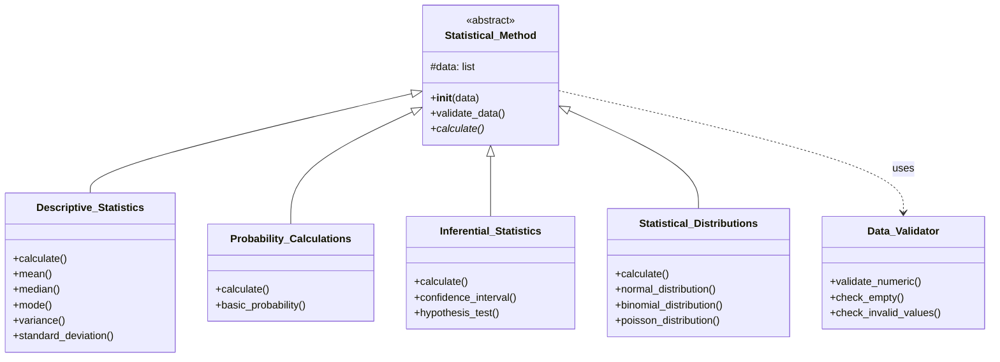

```mermaid
classDiagram
    direction TB
    class Statistical_Method {
        <<abstract>>
        #data: list
        +__init__(data)
        +validate_data()
        +calculate()*
    }

    class Descriptive_Statistics {
        +calculate()
        +mean()
        +median()
        +mode()
        +variance()
        +standard_deviation()
    }

    class Probability_Calculations {
        +calculate()
        +basic_probability()
    }

    class Inferential_Statistics {
        +calculate()
        +confidence_interval()
        +hypothesis_test()
    }

    class Statistical_Distributions {
        +calculate()
        +normal_distribution()
        +binomial_distribution()
        +poisson_distribution()
    }

    class Data_Validator {
        +validate_numeric()
        +check_empty()
        +check_invalid_values()
    }

    Statistical_Method <|-- Descriptive_Statistics
    Statistical_Method <|-- Probability_Calculations
    Statistical_Method <|-- Inferential_Statistics
    Statistical_Method <|-- Statistical_Distributions

    Statistical_Method ..> Data_Validator : uses
```